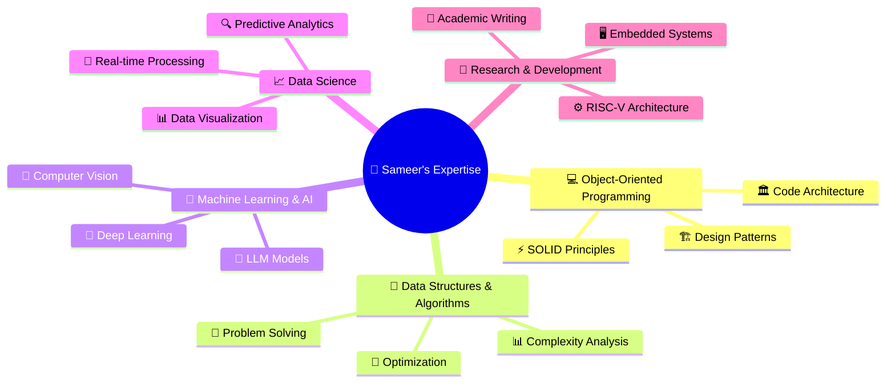

# Hi there, I'm Sameer Mankotia! 👋

  

  
  

---

## 🚀 About Me

> *"Code is poetry written in logic"*

I'm a **Ph.D. Computer Science student** at the University of Idaho, passionate about pushing the boundaries of technology. My journey spans from crafting elegant software solutions to pioneering research in RISC-V assembly languages. I believe in the power of code to solve real-world problems and create meaningful impact.

🔬 **Current Focus:** Developing efficient simulators for RISC-V instruction sets  
🎯 **Goal:** Contributing to the next generation of embedded systems and computer architecture  
🏆 **Recognition:** 2024-25 Best Student Employee Award & Smart India Hackathon 3rd Runner-Up  

---

## 🛠️ Tech Stack & Tools

### Programming Languages

  
  
  
  
  
  

### Frontend Development

  
  
  
  
  

### Backend Development

  
  
  
  

### Databases

  
  
  

### DevOps & Tools

  
  
  
  
  
  

### Testing & Quality Assurance

  
  

---

## 🏆 Certifications & Achievements

  
| 🎖️ **Certification** | 🏅 **Achievement** |
|:---:|:---:|
|  |  |
|  |  |

---

## 📊 GitHub Analytics

  

  

  
**🔥 Current Streak:** 50 days • **🏆 Longest Streak:** 210 days • **📊 Total Contributions:** 2,847 commits

---

## 💼 Professional Experience

### 🏢 **Internship Journey**

  
  
  
  

**🎯 Organizations:** Cisco Systems • DRDO (Defense Research & Development Organization) • Hewlett Packard Enterprise • University of Idaho

---

## 📚 Featured Research

### 🔬 **Current Research Focus**
> **RISC-V Simulator Development** - Architecting efficient simulators for RISC-V instruction sets with modular design and comprehensive testing frameworks, targeting embedded systems applications.

### 📄 **Recent Publication**
**[Deep Learning-Powered Interactive Art: A Framework for Gesture Recognition and Multi-Style Digital Painting using MediaPipe and TensorFlow](https://www.irejournals.com/formatedpaper/1706740.pdf)**
*Exploring the intersection of AI and creative expression through innovative gesture-based interfaces.*

---

## 🎯 Specialties

  

### 🌟 Core Competencies

---

## 🤝 Let's Connect & Collaborate

  

---

  
### 💡 *"Innovation distinguishes between a leader and a follower"*

**Open to collaborations • Research opportunities • Exciting projects**

